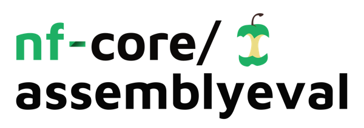
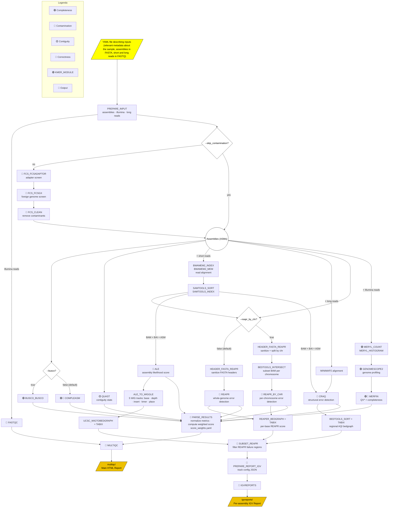

<h1>
  <picture>
    <source media="(prefers-color-scheme: dark)" srcset="docs/images/nf-core-assemblyeval_logo_dark.png">
    
  </picture>
</h1>

[](https://github.com/nf-core/assemblyeval/actions/workflows/ci.yml)
[](https://github.com/nf-core/assemblyeval/actions/workflows/linting.yml)[](https://nf-co.re/assemblyeval/results)[](https://doi.org/10.5281/zenodo.XXXXXXX)
[](https://www.nf-test.com)

[](https://www.nextflow.io/)
[](https://docs.conda.io/en/latest/)
[](https://www.docker.com/)
[](https://sylabs.io/docs/)
[](https://cloud.seqera.io/launch?pipeline=https://github.com/nf-core/assemblyeval)

[](https://nfcore.slack.com/channels/assemblyeval)[](https://twitter.com/nf_core)[](https://mstdn.science/@nf_core)[](https://www.youtube.com/c/nf-core)

## Introduction

**Assemblyeval** accepts genome assemblies (FASTA), paired-end Illumina reads, and long reads (ONT or PacBio) via a YAML samplesheet, optionally cleaning them of contamination before evaluation. The pipeline systematically assesses contiguity (QUAST), completeness (COMPLEASM/BUSCO, Merfin), and correctness (ALE, REAPR, CRAQ) — combining read-alignment-based and k-mer-based evidence into a single normalized weighted score. Final outputs include a comparative MultiQC report ranking assemblies across all metrics and an IGV-based interactive report for manual inspection of putative structural errors.


<!--  -->



<!-- TODO nf-core: Include a figure that guides the user through the major workflow steps. Many nf-core
     workflows use the "tube map" design for that. See https://nf-co.re/docs/contributing/design_guidelines#examples for examples.   -->
<!-- TODO nf-core: Fill in short bullet-pointed list of the default steps in the pipeline -->

1. Parse and prepare input samplesheet (`PREPARE_INPUT`: assemblies · Illumina reads · long reads)
2. Read QC ([`FastQC`](https://www.bioinformatics.babraham.ac.uk/projects/fastqc/))
3. Contamination screening and removal (_Optional_, `--skip_contamination`):
   1. Adapter/vector screen ([`FCS-adaptor`](https://github.com/ncbi/fcs))
   2. Foreign genome screen ([`FCS-GX`](https://github.com/ncbi/fcs))
   3. Generate cleaned assembly ([`FCS-CLEAN`](https://github.com/ncbi/fcs))
4. Contiguity assessment ([`QUAST`](https://github.com/ablab/quast))
5. Completeness assessment (choice of):
   1. [`COMPLEASM`](https://github.com/huangnengCSU/compleasm) _(default)_
   2. [`BUSCO`](https://busco.ezlab.org/) _(optional, `--busco`)_
6. K-mer profiling and QV estimation:
   1. K-mer counting ([`Meryl`](https://github.com/marbl/meryl))
   2. Genome profiling ([`GenomeScope2`](https://github.com/tbenavi1/genomescope2.0))
   3. K-mer completeness and QV* score ([`Merfin`](https://github.com/arangrhie/merfin))
7. Short-read alignment to assemblies ([`BWA-MEM2`](https://github.com/bwa-mem2/bwa-mem2), [`SAMtools`](https://www.htslib.org/))
8. Long-read alignment to assemblies ([`Minimap2`](https://github.com/lh3/minimap2))
Here's the corrected item 9:

9. Correctness assessment:
   1. Assembly likelihood score ([`ALE`](https://github.com/sc932/ALE)) — evaluates short-read alignments using a Bayesian framework to compute a global log-probability score that the assembly is correct, integrating four per-nucleotide metrics: alignment concordance, insert size consistency, depth of coverage uniformity, and k-mer frequency
   2. Structural error detection ([`CRAQ`](https://github.com/bioinfo-biols/CRAQ)) — uses clipped (split-mapped) short- and long-read alignments to identify regional and structural errors, reporting a Regional Assembly Quality Index (R-AQI) and a Structural Assembly Quality Index (S-AQI) on a 0–100 scale
   3. Error region detection via Fragment Coverage Distribution ([`REAPR`](https://www.sanger.ac.uk/tool/reapr/)) — evaluates the discrepancy between observed paired-read mapping coverage and theoretical expectations (FCD error), scoring each base from 0 to 1 based on read orientation, insert size consistency, and soft-clipping evidence; two run modes are supported:
      1. Whole-assembly mode _(default)_ — runs REAPR across the entire assembly at once
      2. Per-contig mode _(optional, `--reapr_by_chr true`)_ — splits the assembly by contig/chromosome, subsets the BAM accordingly with [`BEDTools`](https://github.com/arq5x/bedtools2/), and runs REAPR independently per contig; recommended for large assemblies (>500 Mbp)
10. Convert correctness scores to indexed BEDGraph tracks ([`UCSC wigToBedGraph`](http://hgdownload.soe.ucsc.edu/admin/exe/), [`Tabix`](https://www.htslib.org/), [`BEDTools`](https://github.com/arq5x/bedtools2/))
11. Filter and prepare candidate misassembly regions for visualization (`SUBSET_REAPR`, `PREPARE_REPORT_IGV`)
12. Generate interactive per-assembly error report ([`IGV-Reports`](https://github.com/igvteam/igv-reports))
13. Aggregate metrics, compute weighted ranking scores and present QC ([`MultiQC`](http://multiqc.info/))

> [!WARNING]
> The contamination module requires the pre-download of the **FCS-GX database**, which demands a substantial amount of disk space and a **minimum of 512 GB of RAM** for full-performance execution. Running with less memory is possible but may result in up to a **10,000× performance penalty**. For this reason, we strongly recommend running the contamination steps (`--skip_contamination false`) only on **HPC (High-Performance Computing)** environments.
>
> If you do not have access to HPC infrastructure, you can run **FCS-GX online via Galaxy** — [ncbi_fcs_gx on Galaxy](https://usegalaxy.org/?tool_id=toolshed.g2.bx.psu.edu%2Frepos%2Fiuc%2Fncbi_fcs_gx%2Fncbi_fcs_gx%2F0.5.0%2Bgalaxy0&version=latest) — and then use the resulting decontaminated FASTA file as input to **nf-core/assemblyeval** with `--skip_contamination`.

## Usage

> [!NOTE]
> If you are new to Nextflow and nf-core, please refer to [this page](https://nf-co.re/docs/usage/installation) on how to set-up Nextflow. Make sure to [test your setup](https://nf-co.re/docs/usage/introduction#how-to-run-a-pipeline) with `-profile test` before running the workflow on actual data.

Prepare an `assemblysheet.yaml` with the following fields:

- **`metadata`**: organism-level metadata shared across assemblies:
  - `id`: sample or organism name
  - `kmer_size`: k-mer size for tools like `Meryl`
  - `ploidy`: ploidy level
  - `organism_domain`: `euk` or `prok`
  - `taxid`: NCBI taxonomy ID
  - `busco_lineages`: BUSCO lineage(s) for completeness evaluation
- **`assembly`**: one or more assemblies to evaluate. Each entry requires a unique `id` (no spaces) and `pri_asm` with the path to the FASTA file.
- **`illumina`**: paired-end Illumina reads (`read1` and `read2`).
- **`ont`**: long reads file path. For PacBio data, pass `--map-pb` when running the pipeline.


Below is an example [`assemblysheet.yaml`](assets/chla_test_input_channels.yaml) evaluating four assemblies of *C. trachomatis*:

```yaml
samples:
  - metadata:
      id: Ctrachomatis
      kmer_size: 21
      ploidy: 1
      organism_domain: prok
      taxid: "315277"
      busco_lineages:
        - "chlamydiae_odb10"
    assembly:
      - id: ref
        pri_asm: "./data_test/GCF_000012125.1_ASM1212v1_genomic.fasta"
      - id: ctracho_5inversions_default
        pri_asm: "./data_test/ctracho_5inversions_default.simseq.genome.fa"
    illumina:
      - read1: "./data_test/mason_R1_001.fastq.gz"
        read2: "./data_test/mason_R2_001.fastq.gz"
    ont:
      - reads: "./data_test/ont_reads_pbsim3.fq.gz"
```

To get started, clone the repository, enter the folder, and test the pipeline using the bundled C. trachomatis test dataset:

```bash
git clone https://github.com/rodtheo/nf-assemblyeval.git

cd nf-assemblyeval

export NXF_VER=25.04.3

nextflow run main.nf \
   -profile docker \
   --max_cpus <N> \
   --input assets/chla_test_input_channels.yaml \
   --outdir <OUTDIR>
```

Once the pipeline completes, the main outputs are:
- **General evaluation report**: `<OUTDIR>/multiqc/Report-for-General-Evaluation-of-Assemblies_multiqc_report.html`
- **Per-assembly error inspection**: `<OUTDIR>/igvreports/`

> [!WARNING]
> Provide pipeline parameters via the CLI or `--params-file`. The `-c` Nextflow option handles configuration only and **cannot** set pipeline parameters. See [docs](https://nf-co.re/usage/configuration#custom-configuration-files).

For more details, see the [usage documentation](https://nf-co.re/assemblyeval/usage) and [parameter documentation](https://nf-co.re/assemblyeval/parameters).

## Pipeline output

To see the results of an example test run with a full size dataset refer to the [results](https://rodtheo.github.io/simposio-biomol-2024/simulations/Report-for-General-Evaluation-of-Assemblies_multiqc_report.html) and the [IGV report](https://rodtheo.github.io/simposio-biomol-2024/simulations/Ctrachomatis_ctracho_5inversions_default_report_mqc.html).

After the pipeline finishes, the main outputs are self-contained HTML located at `<OUTDIR>/multiqc/` and `<OUTDIR>/igvreport/`.

For more details about the output files and reports, please refer to the
[output documentation]().

## Disclaimer

This is not an official nf-core community pipeline (at least, not yet), although it strives to follow the community's recommended standards as closely as possible.

## Credits

nf-core/assemblyeval was originally written by Rodrigo Theodoro Rocha.

We thank the following people for their extensive assistance in the development of this pipeline:

<!-- TODO nf-core: If applicable, make list of people who have also contributed -->

## Contributions and Support

If you would like to contribute to this pipeline, please see the [contributing guidelines](.github/CONTRIBUTING.md).

For further information or help, don't hesitate to get in touch on the [Slack `#assemblyeval` channel](https://nfcore.slack.com/channels/assemblyeval) (you can join with [this invite](https://nf-co.re/join/slack)).

## Citations

<!-- TODO nf-core: Add citation for pipeline after first release. Uncomment lines below and update Zenodo doi and badge at the top of this file. -->
<!-- If you use nf-core/assemblyeval for your analysis, please cite it using the following doi: [10.5281/zenodo.XXXXXX](https://doi.org/10.5281/zenodo.XXXXXX) -->

<!-- TODO nf-core: Add bibliography of tools and data used in your pipeline -->

An extensive list of references for the tools used by the pipeline can be found in the [`CITATIONS.md`](CITATIONS.md) file.

You can cite the `nf-core` publication as follows:

> **The nf-core framework for community-curated bioinformatics pipelines.**
>
> Philip Ewels, Alexander Peltzer, Sven Fillinger, Harshil Patel, Johannes Alneberg, Andreas Wilm, Maxime Ulysse Garcia, Paolo Di Tommaso & Sven Nahnsen.
>
> _Nat Biotechnol._ 2020 Feb 13. doi: [10.1038/s41587-020-0439-x](https://dx.doi.org/10.1038/s41587-020-0439-x).
